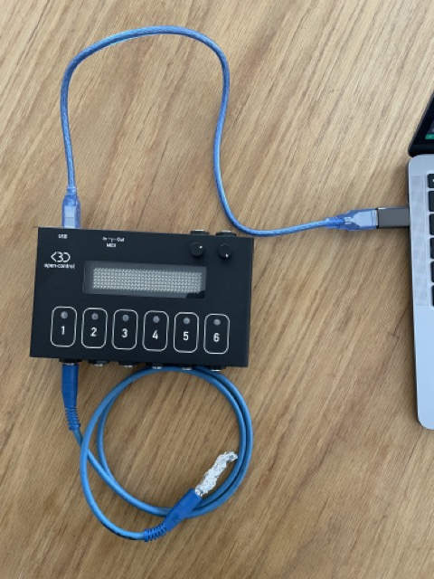

# open·control firmware

Version 1.4  
Changelog [here](https://github.com/KBLiveSolutions/open.control/discussions/6)

## To install :

- Download the file **open_control_firmware_1.4.ino.uf2**
- Connect the USB cable of open·control ***while holding Button 1***. 
- A flash drive named **RPI-RP2** will appear.  
- Drag and drop the **.uf2** file inside it.  
- The board will reboot with the new firmware installed.  

**- Boxed :**
If you don't have any pedal to plug to switch Input 1, you can connect any mono Jack with the end wrapped with tinfoil as shown on the picture below.
- Unplug open·control
- Insert the cable with tinfoil
- Plug the USB cable
- Remove the cable with tinfoil
- Drop the .uf2 file on the RPI-RP2 drive that appeared

**- Maker :**
If you don't have soldered buttons, you can press the mini-switch next to the MCU while plugging the USB cable.

More info on the [open·control Wiki(url=https://github.com/KBLiveSolutions/open.control/wiki)]

## To change the code :
1. install the Arduino software : https://www.arduino.cc/en/software
2. Open Arduino and go to File->Preferences.
3. In the dialog that pops up, enter the following URL in the "Additional Boards Manager URLs" field:
https://github.com/earlephilhower/arduino-pico/releases/download/global/package_rp2040_index.json
![Capture d’écran 2022-02-24 à 08.23.15.png]
4. Go to Sketck-> Include Library and click on Manage Libraries...
5. In the window search field, find and install the following libraries :
    - Adafruit_TinyUSB (if it asks to install other libraries, select Yes)
    - OneButton
    - MIDI
    - Adafruit_NeoPixel
    - RotaryEncoder (the one selected in the picture below)
 ![Capture d’écran 2022-02-24 à 08.19.15.png]
6. Download and unzip the firmware : https://github.com/KBLiveSolutions/open.control-firmware/archive/refs/heads/main.zip
7. Open the file open_control_firmware.ino in Arduino
8. In Arduino go to Tools-> 
    - Open Board Manager and search for "Pico"
    - Install Raspberry Pi Pico/RP2040 by Earle F. Philhower
    - Board: Select "Raspberry Pi RP2040 Boards" then "Raspberry Pi Pico"
    - USB Stack: "Adafruit Tiny USB"
    - Port: there should be a line that corresponds to the open·control board. It should appear as a COM port, but I don't know exactly the name. If you can't find it, unplug open·control, look at the Port menu, then plug it and select the new line.
9. Click on the "Upload" arrow in the top menu (Ctrl U)
**=> The code should be uploaded to  open·control !**
